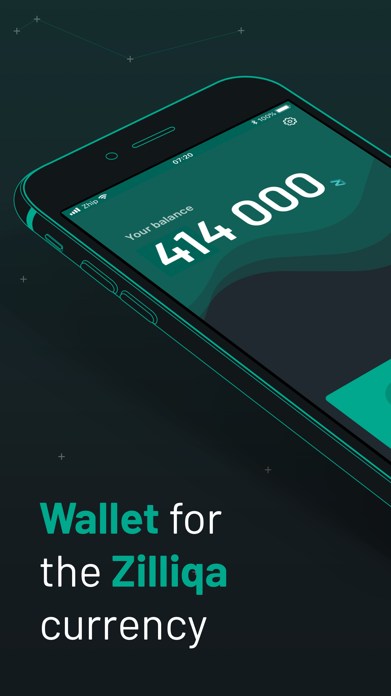
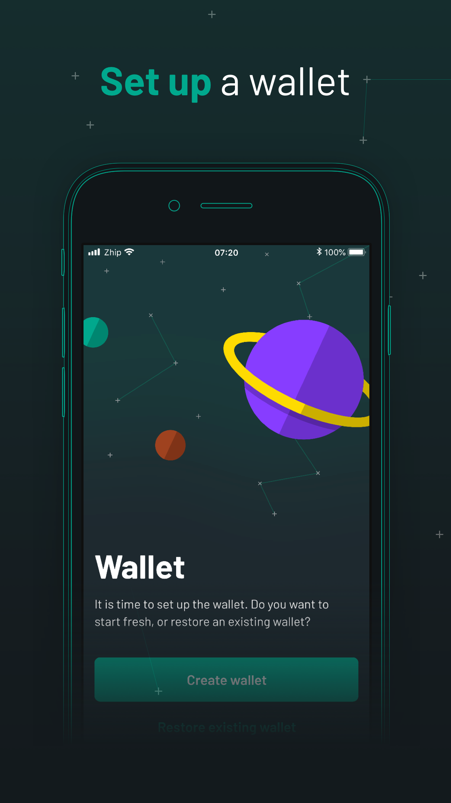
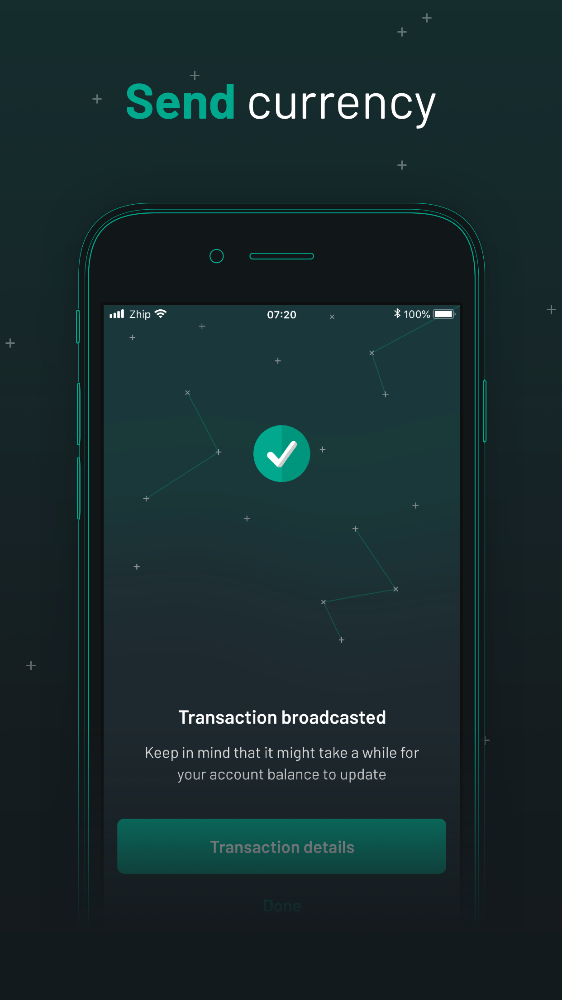
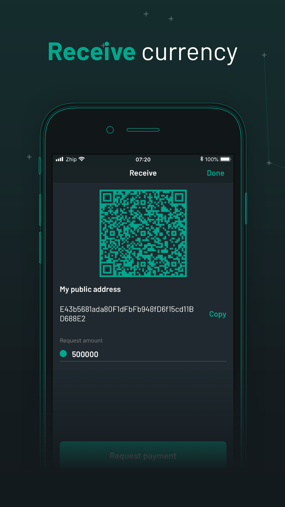
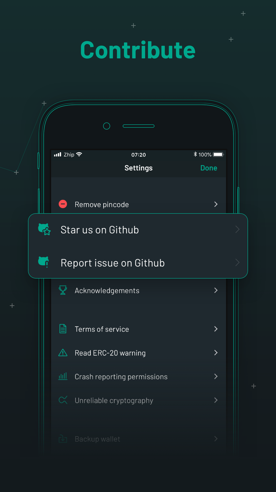

Zhip is the worlds first iOS wallet for the blockchain Zilliqa. The source code and the content is publically available at [Github](https://github.com/OpenZesame/Zhip).

Manage your Zillings (Zils, Zilliqa currency) quickly and easily with the Zhip wallet app. Easily create or restore your wallet, check your current balance and swiftly send or receive Zils, all from the app. You can even request a transaction by a simple and secure URL. 

Available features
* Create a brand new wallet
* Restore an existing wallet
* Check your Zil balance
* Send and receive Zils
* Request a transaction (custom amount) by URL
* QR code and scanner for quick transactions
* 4-digit PIN protection 
* Back up your wallet

{:class="img-responsive"}

{:class="img-responsive"}

{:class="img-responsive"}

{:class="img-responsive"}

{:class="img-responsive"}